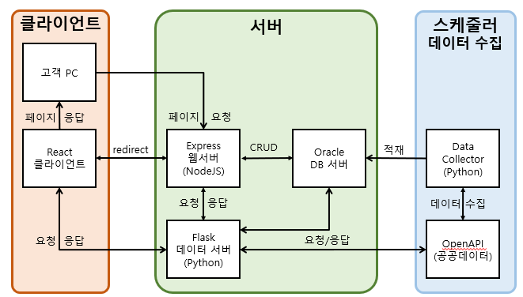
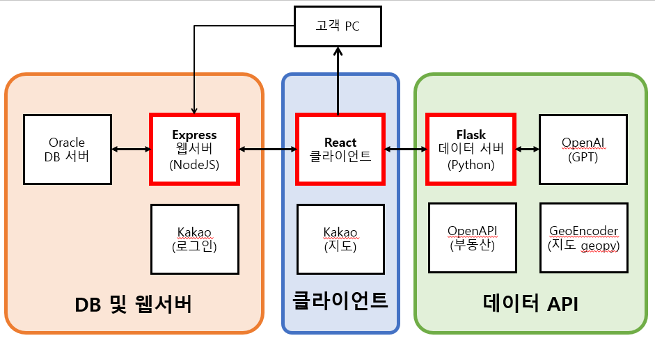
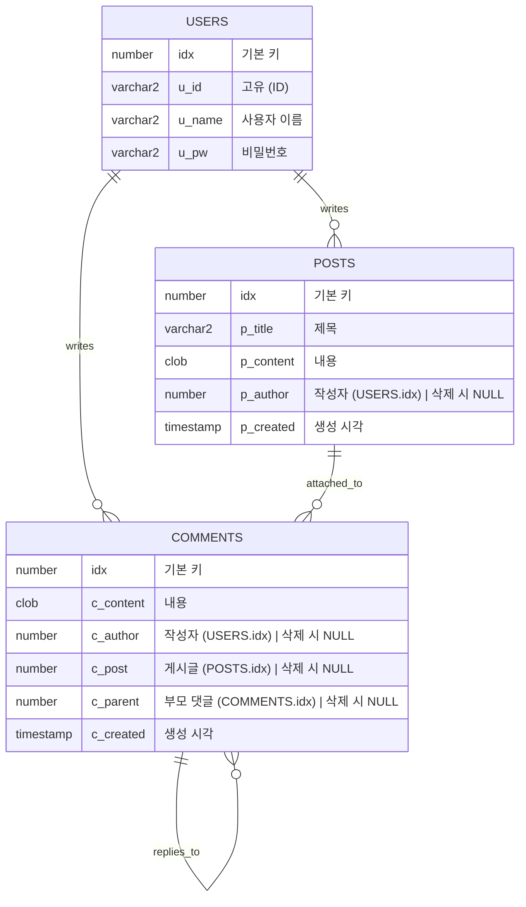

# Codelabit_AICC_Project_03
## [배포화면 바로가기](https://aicc3.wbpark.app/react)
- ### [배포 화면](https://aicc3.wbpark.app/react)
- ### [개발 화면](https://aicc3.wbpark.app/)
- ### [리액트](https://aicc3flask.wbpark.app)

## 개요
### 팀원 소개
|역할|이름|담당|
|---|---|---|
|팀장  | 박원빈 | PM, PL, Full-Stack
|데이터| 정승호 | Flask, API
|백앤드| 이정훈 | Express, Oracle, 
|프론트| 김여진 | React 

### 주차별 활동
| 구분 | 주차 |시작일 | 활동내역 |
|---|---|---|---|
| 시작 | 1주차 | 4/08(월) | React, Express,Flask 복습
| 기획 | 2주차 | 4/17(수) | 화면 기획 및 기능 설계
| 구현 | 3주차 | 4/24(수) | 인원별로 서버 하나씩 개발 및 구현
| 종합 | 4주차 | 5/03(금) | 각자 만든 것 통합, 추가 기능 개발
| 발표 | 5주차 | 5/08(수) | stt/tts 추가, AWS 배포, 발표

### 팀원 업무일지
| 이름 | 메인 | sub | 
|---|---|---|
|박원빈| [문서정리](https://github.com/ParkWonBin/Codelabit_AICC_Project_03/tree/main/_Documents)|
|정승호| [일지](_Documents/_ToDoList_1_jhoho0923.md)| [노트](_Documents/_Note_2_junghoon0904.md)|
|이정훈| [일지](_Documents/_Note_2_junghoon0904.md) | [할일](_Documents/_ToDoList_2_junghoon0904.md)|
|김여진| [일지](_Documents/_Note_3_yeojin10044.md)  | [할일](_Documents/_ToDoList_3_yeojin10044.md), [공부](_Documents/_study/yj_memo.md)|

## 프로젝트 아키텍처
초안

최종

## 요구사항

## 구현기능
1. 로그인 :
    => 회원관리, 개인화 서비스
    - [Express] [API-Kakao-OAuth] 소셜 로그인
    - [Express] 로그인, 회원가입, 회원탈퇴 (생성/조회/삭제)

2. 게시판 :
    => 커뮤니티, 회원간 소통 창구
    - [Express] 동적으로 목록 표시 및 정렬 
    - [Express] 상세화면 : 게시글 (조회), 댓글 (조회)
    - [Express] 게시글 (생성/수정/삭제)
    - [Express] 댓글 (생성/삭제)
    - [Express] 대댓글 기능 (내용에 "@숫자"로 댓글 id 입력)

3. 쳇봇 :
    => 편의성, 서비스 안내
    - [React] [Chatbot] 기본적은 UI 적용
    - [Flask] [API-OpenAI] GPT 연결하여 응답 표시
    - [Flask] [API-OpenAI] GPT 과금 계산하여 표시

4. 지도 
    => 검색 및 조회 서비스
    - [Flask] [API-GeoEncoder] 검색 기능 구현
    - [React] [API-Kakao-Map] 지도 표시

5. 통계
    => 공공 데이터 조회 서비스
    - [React] [Chart] 화면에 차트 표시하기
    - [Flask] 더미 데이터 불러오기
    - [React] [API-Kakao-Map] 클릭한 데이터 위치로 이동
    x [Flask] [API-OpenAPI] 공공 데이터 불러오기(더미)

## DB 
### 데이터베이스 스키마
#### 사용자 (Users)
| 필드명  | 데이터 타입 | 설명                  | 제약조건     |
|-------|-----------|---------------------|-----------|
| idx   | NUMBER    | 사용자 고유번호          | 기본 키      |
| u_id  | VARCHAR2  | 사용자 ID            | 고유 키      |
| u_name| VARCHAR2  | 사용자 이름            | 없음        |
| u_pw  | VARCHAR2  | 사용자 비밀번호          | 없음        |

#### 게시글 (Posts)
| 필드명     | 데이터 타입 | 설명                  | 제약조건                   |
|----------|-----------|---------------------|-------------------------|
| idx      | NUMBER    | 게시글 고유번호          | 기본 키                    |
| p_title  | VARCHAR2  | 게시글 제목             | 없음                      |
| p_content| CLOB      | 게시글 내용             | 없음                      |
| p_author | NUMBER    | 게시글 작성자 외래 키        | 외래 키 (`Users.idx` 참조), 삭제 시 NULL |
| p_created| TIMESTAMP | 게시글 생성 시각           | 없음                      |

#### 댓글 (Comments)
| 필드명     | 데이터 타입 | 설명                  | 제약조건                                     |
|----------|-----------|---------------------|-------------------------------------------|
| idx      | NUMBER    | 댓글 고유번호          | 기본 키                                      |
| c_content| CLOB      | 댓글 내용             | 없음                                        |
| c_author | NUMBER    | 댓글 작성자 외래 키        | 외래 키 (`Users.idx` 참조), 삭제 시 NULL           |
| c_post   | NUMBER    | 대응 게시글 외래 키         | 외래 키 (`Posts.idx` 참조), 삭제 시 NULL           |
| c_parent | NUMBER    | 부모 댓글 외래 키          | 외래 키 (`Comments.idx` 참조), 삭제 시 NULL        |
| c_created| TIMESTAMP | 댓글 생성 시각           | 없음                                        |

### 데이터베이스 ER 

## React 구조
| 파일명                | 주요내용                             | 관련된 요청 URL 정보                        | 목적지    |
|----------------------|-------------------------------------|------------------------------------------|----------|
| `Navigation.js`      | 네비게이션 바 구현                   | 없음                                      | 없음      |
| `Main.js`            | 메인 페이지 레이아웃                 | 없음                                      | 없음      |
| `Footer.js`          | 하단 푸터 구현                       | 없음                                      | 없음      |
| `Map.js`             | 카카오 맵 API를 사용한 지도 표시     | `/getGeoData`                             | Flask     |
| `About.js`           | 회사 정보 페이지                     | 없음                                      | 없음      |
| `Board_.js`          | 게시글 목록 조회                     | `/postReadBoard`                          | Express   |
| `Board_Create.js`    | 새 게시글 작성                      | `/postCreate`                             | Express   |
| `Board_Detail.js`    | 게시글 상세 보기 - 게시글 정보 조회  | `/postReadDetail/post`                    | Express   |
| `Board_Detail.js`    | 게시글 상세 보기 - 댓글 정보 조회    | `/postReadDetail/comments`                | Express   |
| `Board_Detail.js`    | 게시글 상세 보기 - 게시글 삭제       | `/postDelete`                             | Express   |
| `Board_Detail.js`    | 게시글 상세 보기 - 댓글 삭제         | `/commentDelete`                          | Express   |
| `Board_Detail.js`    | 게시글 상세 보기 - 댓글 생성         | `/commentCreate`                          | Express   |
| `Board_Update.js`    | 게시글 수정                          | `/postUpdate`                             | Express   |
| `Login_.js`          | 로그인 페이지                        | 없음                                      | 없음      |
| `Login_Auth.js`      | 사용자 인증 처리                     | `/userLogin`                              | Express   |
| `Login_MyPage.js`    | 사용자 마이페이지                    | `/userDelete`                             | Express   |
| `Login_SignUp.js`    | 사용자 등록 페이지                   | `/userCreate`                             | Express   |
| `Chatbot.js`         | 챗봇 인터페이스                      | `/getGPTMessage`                          | Flask     |
| `Static_.js`         | 통계 데이터 페이지                   | 없음                                      | 없음      |
| `Static_getDataHeader.js` | 데이터 헤더 가져오기          | `/getData`                                | Flask     |
| `Static_kakaoMap.js` | 지도 데이터 시각화                   | 없음                                      | 없음      |
| `Static_pieChart.js` | 파이 차트 데이터 시각화              | 없음                                      | 없음      |
| `Static_table.js`    | 데이터 테이블 시각화                 | 없음                                      | 없음      |
| `KakaoSocialLogin.js`| 카카오 소셜 로그인 - 로그인          | `/userLogin`                              | Express   |
| `KakaoSocialLogin.js`| 카카오 소셜 로그인 - 사용자 생성     | `/userCreate`                             | Express   |

## Express 구조
| 엔드포인트                  | 요청 메소드 | 관련파일            | 주요내용                       | db 함수(파일명)               |
|--------------------------|-----------|-------------------|------------------------------|----------------------------|
| `/dev`                   | GET       | `dev.js`           | 개발용 테스트 페이지           | 없음                        |
| `/index`                 | GET       | `index.js`         | 메인 페이지                   | 없음                        |
| `/api/kakao/maps`        | 사용 안함 | `kakaoMaps.js`     | 카카오 맵 API 라우터           | 없음                        |
| `/userLogin`             | GET, POST | `userLogin.js`     | 사용자 로그인 페이지 및 처리    | `db_userLogin.js`          |
| `/userCreate`            | GET, POST | `userCreate.js`    | 사용자 생성 페이지 및 처리      | `db_userCreate.js`         |
| `/userDelete`            | POST      | `userDelete.js`    | 사용자 삭제                    | `db_userDelete.js`         |
| `/postReadBoard`         | GET       | `postReadBoard.js` | 게시판 목록 조회               | `db_postReadBoard.js`      |
| `/postReadDetail/post`   | POST      | `postReadDetail.js`| 게시글 상세 정보 조회          | `db_postReadDetailPost.js` |
| `/postReadDetail/comments`| POST      | `postReadDetail.js`| 게시글 댓글 정보 조회          | `db_postReadDetailComments.js` |
| `/postCreate`            | POST      | `postCreate.js`    | 게시글 생성                    | `db_postCreate.js`         |
| `/postUpdate`            | POST      | `postUpdate.js`    | 게시글 수정                    | `db_postUpdate.js`         |

## Flask 구조
| 엔드포인트       | 요청 메소드 | 연결된 API 파일       |
|----------------|-----------|--------------------|
| `/`            | GET       | `Index.py` (정적 페이지) |
| `/getData`     | GET       | `getData.py`       |
| `/getData2`    | GET       | `getData2.py`      |
| `/testAPI`     | GET       | `testAPI.py`       |
| `/getGeoData`  | POST       | `getGeoData.py`    |
| `/getGPTMessage` | POST     | `getGPTMessage.py` |
